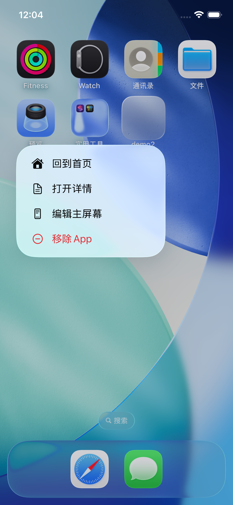

# QuickActionsKit

主屏幕快捷操作（Home Screen Quick Actions）的轻量封装，提供 `setup` / `bind` / `handle` / `refresh` 等 API，基于系统原生 `UIApplicationShortcutItem`。

## 预览

<p align="center">
  
</p>

## 要求

- iOS 13.0+
- UIKit + Scene 生命周期（`SceneDelegate`）
- CocoaPods 集成需安装 [cocoapods-spm](https://github.com/trinhngocthuyen/cocoapods-spm) 插件

## 安装

### Swift Package Manager（GitHub）

Xcode → **File → Add Package Dependencies**，填入仓库地址，或在 `Package.swift` 中：

```swift
dependencies: [
    .package(url: "https://github.com/youpeng520/QuickActionsKit.git", from: "1.0.0"),
],
targets: [
    .target(name: "YourApp", dependencies: ["QuickActionsKit"]),
]
```

### CocoaPods（cocoapods-spm）

本库通过 Swift Package 分发，CocoaPods 需借助 **[cocoapods-spm](https://github.com/trinhngocthuyen/cocoapods-spm)** 插件才能使用 `spm_pkg`。

**1. 安装插件（只需一次）**

```bash
gem install cocoapods-spm
```

安装后可用下面命令确认：

```bash
pod plugins installed
# 列表中应包含 cocoapods-spm
```

**2. 在 Podfile 中声明插件并添加依赖**

```ruby
source 'https://cdn.cocoapods.org/'
platform :ios, '13.0'

plugin 'cocoapods-spm'   # 必须写在 target 之前

target 'YourApp' do
  use_frameworks!

  spm_pkg 'QuickActionsKit',
    :git => 'https://github.com/youpeng520/QuickActionsKit.git',
    :tag => '1.0.0'
end
```

**3. 安装并打开 workspace**

```bash
pod install
open YourApp.xcworkspace
```

> 请使用 `.xcworkspace` 编译，不要直接打开 `.xcodeproj`。

**本地路径开发（可选）**

```ruby
spm_pkg 'QuickActionsKit', :path => './QuickActionsKit'
```

---

## 快速理解

| 层级 | 谁负责 | 做什么 |
|------|--------|--------|
| **库** | `QuickActionsKit` | 注册菜单、刷新、解析点击、通用 `pushIfNeeded` |
| **App** | 你的工程 | 定义有哪些快捷项、点击后跳哪个页面 |

库**不包含**具体页面跳转；快捷项列表和 `route` 跳转逻辑需在你自己的 App 工程里实现（下文示例可直接复制）。

---

## 集成步骤（UIKit + SceneDelegate）

### 1. 定义快捷项（App 内）

在业务工程中扩展或单独文件配置菜单项，`type` 为唯一标识，点击后用于分支判断：

```swift
import QuickActionsKit

extension QuickActionItem {
    static let appItems: [QuickActionItem] = [
        QuickActionItem(
            title: "回到首页",
            type: "home",
            subtitle: "返回首页",
            icon: .type(.home)
        ),
        QuickActionItem(
            title: "扫一扫",
            type: "scan",
            icon: .system("qrcode.viewfinder")
        ),
        QuickActionItem(
            title: "自定义图标",
            type: "custom",
            icon: .template("my_icon")  // Assets 中的图片名，建议 Template 渲染
        ),
        QuickActionItem(
            title: "会员专享",
            type: "vip",
            availability: { UserManager.shared.isVIP }  // false 时不显示
        ),
    ]
}
```

**图标类型：**

| 写法 | 说明 |
|------|------|
| `.system("sparkles")` | SF Symbol |
| `.template("asset_name")` | Assets 中的模板图 |
| `.type(.home)` | 系统预置类型（`.search`、`.play` 等） |

系统最多展示 **4** 项，超出部分会被截断。

### 2. AppDelegate：启动时注册菜单

```swift
import UIKit
import QuickActionsKit

@main
class AppDelegate: UIResponder, UIApplicationDelegate {
    func application(
        _ application: UIApplication,
        didFinishLaunchingWithOptions launchOptions: [UIApplication.LaunchOptionsKey: Any]?
    ) -> Bool {
        QuickActionsKit.setup(actions: QuickActionItem.appItems)
        return true
    }
}
```

`setup` 会把配置写入 `UIApplication.shared.shortcutItems`，用户长按 App 图标即可看到菜单。

### 3. SceneDelegate：窗口就绪后绑定跳转

**顺序很重要：** 先创建 `window` 和导航栈，再 `bind`，否则冷启动跳转时还没有可操作的 UI。

```swift
import UIKit
import QuickActionsKit

class SceneDelegate: UIResponder, UIWindowSceneDelegate {
    var window: UIWindow?

    func scene(
        _ scene: UIScene,
        willConnectTo session: UISceneSession,
        options connectionOptions: UIScene.ConnectionOptions
    ) {
        guard let windowScene = scene as? UIWindowScene else { return }

        let window = UIWindow(windowScene: windowScene)
        let nav = UINavigationController(rootViewController: HomeViewController())
        window.rootViewController = nav
        window.makeKeyAndVisible()
        self.window = window

        // 设置点击回调；若从快捷项冷启动，pendingShortcut 会自动 handle
        QuickActionsKit.bind(pendingShortcut: connectionOptions.shortcutItem) { item in
            route(item, navigationController: nav)
        }
    }

    func sceneWillResignActive(_ scene: UIScene) {
        // 进后台前刷新，使 availability 等动态条件生效（菜单固定时可省略）
        QuickActionsKit.refresh()
    }

    // 热启动：App 在后台，用户长按图标点选
    func windowScene(
        _ windowScene: UIWindowScene,
        performActionFor shortcutItem: UIApplicationShortcutItem,
        completionHandler: @escaping (Bool) -> Void
    ) {
        completionHandler(QuickActionsKit.handle(shortcutItem))
    }
}
```

### 4. 业务跳转（App 内实现）

```swift
private func route(_ item: QuickActionItem, navigationController: UINavigationController) {
    switch item.type {
    case "home":
        navigationController.popToRootViewController(animated: true)
    case "scan":
        QuickActionsKit.pushIfNeeded(
            ScanViewController(),
            on: navigationController,
            excluding: ScanViewController.self
        )
    default:
        break
    }
}
```

`pushIfNeeded`：栈顶已是目标页则不再 push；否则先 `popToRoot` 再 push，避免重复压栈。

---

## 冷启动 vs 热启动

| 场景 | 触发路径 | 处理方式 |
|------|----------|----------|
| **冷启动** | App 未运行，点快捷项打开 | `willConnectTo` 里 `connectionOptions.shortcutItem` → `bind(pendingShortcut:)` 内部自动 `handle` |
| **热启动** | App 在后台，点快捷项 | `windowScene(_:performActionFor:completionHandler:)` → `QuickActionsKit.handle(shortcutItem)` |

两处都需要实现，缺一不可。

---

## 可选：一步 setup + 回调

若不想分 AppDelegate / SceneDelegate 两次配置，可在 Scene 建窗后：

```swift
QuickActionsKit.setup(actions: QuickActionItem.appItems) { item in
    route(item, navigationController: nav)
}
```

此时可不在 AppDelegate 调用 `setup`（二选一即可）。

---

## API 一览

### QuickActionItem

| 属性 | 说明 |
|------|------|
| `title` | 主标题 |
| `type` | 唯一标识，对应 `UIApplicationShortcutItem.type` |
| `subtitle` | 副标题，可选 |
| `icon` | 图标，可选 |
| `availability` | 返回 `false` 时不展示该项 |

### QuickActionsKit

| 方法 | 说明 |
|------|------|
| `setup(actions:)` | 注册快捷菜单 |
| `setup(actions:onSelect:)` | 注册菜单并设置点击回调 |
| `bind(pendingShortcut:onSelect:)` | 设置回调；传入 `pendingShortcut` 处理冷启动 |
| `handle(_:)` | 解析 `UIApplicationShortcutItem` 并触发回调，返回是否处理成功 |
| `refresh()` | 按 `availability` 重新写入系统菜单 |
| `pushIfNeeded(_:on:excluding:)` | 通用导航辅助 |

---

## 运行示例 App

仓库自带最小 Demo（仅演示快捷操作，无其它依赖）：

```bash
git clone https://github.com/youpeng520/QuickActionsKit.git
cd QuickActionsKit/Example
pod install
open Example/Demo.xcworkspace
```

详见 [Example/README.md](Example/README.md)。

---

## 集成清单

将下面代码复制到你的 App 工程中即可：

- [ ] `extension QuickActionItem` — 配置 `appItems`
- [ ] `AppDelegate` — `QuickActionsKit.setup(actions:)`
- [ ] `SceneDelegate.willConnectTo` — 建窗后 `QuickActionsKit.bind(...)`
- [ ] `SceneDelegate.windowScene(_:performActionFor:)` — `QuickActionsKit.handle`
- [ ] `route(_:navigationController:)` — 按 `item.type` 跳转
- [ ] （可选）`sceneWillResignActive` — `QuickActionsKit.refresh`
